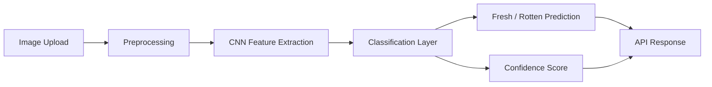
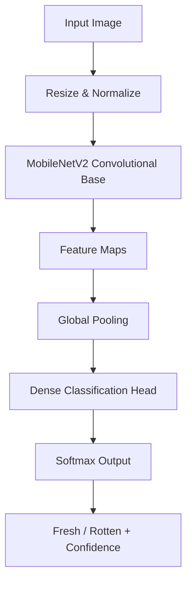
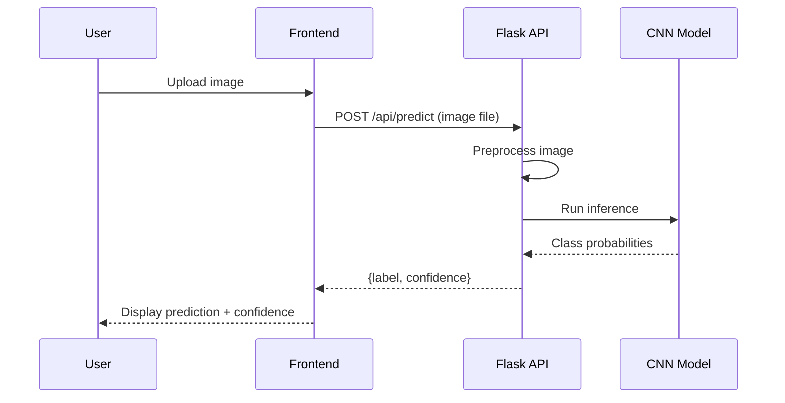
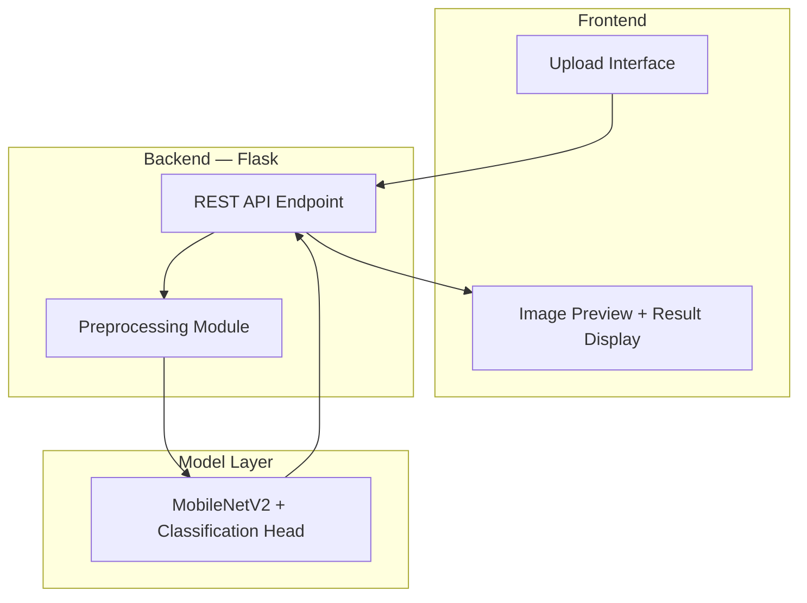

<div align="center">


<br/>

[](https://git.io/typing-svg)

<br/>

<p>
  
  
  
  
</p>
<p>
  
  
  
  
</p>
<p>
  
  
  
  
</p>
<p>
  
  
  
  
</p>

<br/>

<a href="#"></a>
&nbsp;
<a href="https://github.com/TheNameIsBhagavan"></a>
&nbsp;
<a href="https://thenameisbhagavan.vercel.app/"></a>

</div>

<br/>

<!-- Replace with FreshVision AI Prediction Interface Screenshot -->

<div align="center">
  <p><i>Upload an image. FreshVision AI tells you if it's fresh — and how confident it is.</i></p>
</div>

<br/>

---

## Table of Contents

<details>
<summary><b>Click to expand full contents</b></summary>

- [Introduction](#introduction)
- [Vision](#vision)
- [Mission](#mission)
- [Why FreshVision AI](#why-freshvision-ai)
- [Problem Statement](#problem-statement)
- [Solution](#solution)
- [Platform Highlights](#platform-highlights)
- [Feature Overview](#feature-overview)
- [AI Pipeline](#ai-pipeline)
- [Dataset Overview](#dataset-overview)
- [Model Architecture](#model-architecture)
- [CNN Workflow](#cnn-workflow)
- [TensorFlow Pipeline](#tensorflow-pipeline)
- [Image Classification Process](#image-classification-process)
- [Prediction Workflow](#prediction-workflow)
- [Confidence Score Explanation](#confidence-score-explanation)
- [Technology Stack](#technology-stack)
- [System Architecture](#system-architecture)
- [Folder Structure](#folder-structure)
- [Project Modules](#project-modules)
- [Model Training](#model-training)
- [Model Evaluation](#model-evaluation)
- [Performance](#performance)
- [Inference Pipeline](#inference-pipeline)
- [Flask Backend](#flask-backend)
- [Frontend](#frontend)
- [Installation](#installation)
- [Quick Start](#quick-start)
- [Environment Variables](#environment-variables)
- [Local Development](#local-development)
- [Deployment Guide](#deployment-guide)
- [Screenshots](#screenshots)
- [Development Workflow](#development-workflow)
- [Engineering Decisions](#engineering-decisions)
- [Design Philosophy](#design-philosophy)
- [AI Philosophy](#ai-philosophy)
- [Future Improvements](#future-improvements)
- [Known Limitations](#known-limitations)
- [Lessons Learned](#lessons-learned)
- [Contribution Guide](#contribution-guide)
- [License](#license)
- [Acknowledgements](#acknowledgements)
- [Author](#author)
- [Connect With Me](#connect-with-me)

</details>

---

## Introduction

**FreshVision AI** is a deep learning-powered computer vision platform that classifies fruits and vegetables as fresh or rotten from a single uploaded image, returning a prediction alongside a confidence score in real time.

It's built to demonstrate a complete, working computer vision pipeline — not just a trained model in a notebook, but a model wired into a real inference API and a usable web interface.

---

## Vision

To show that a well-scoped computer vision problem — binary freshness classification — can be taken all the way from dataset to a deployed, interactive prediction tool, with every stage of the pipeline engineered deliberately.

---

## Mission

FreshVision AI's mission is to make an otherwise invisible piece of AI — image classification — tangible: upload a photo, get an instant, explainable prediction, with the confidence behind that prediction shown rather than hidden.

---

## Why FreshVision AI

Food waste and quality control are real-world problems where computer vision has obvious, practical value — but most demonstrations stop at "the model gets X% accuracy in a notebook." FreshVision AI was built to go further: wrap the trained model in an inference pipeline, serve it through a real API, and put a usable interface in front of it.

---

## Problem Statement

- Manually inspecting produce for freshness doesn't scale and is inconsistent between inspectors
- Many computer vision class projects stop at model training and never reach a usable interface
- Image classification demos often hide their confidence and preprocessing steps, making the prediction feel like a black box

---

## Solution

FreshVision AI pairs a CNN-based image classifier — built via transfer learning — with a Flask inference API and a responsive web interface. Every prediction returns both a fresh/rotten classification and a confidence score, so the output is interpretable rather than a bare label.

---

## Platform Highlights

- CNN-based classification built on transfer learning rather than a model trained from scratch
- Real-time inference through a Flask REST API, not just an offline notebook prediction
- Confidence score returned alongside every prediction
- Clean, responsive upload-and-predict interface
- Clear separation between training pipeline and inference pipeline, so the model can be retrained independently of the serving code

---

## Feature Overview

| Feature | Description |
|---|---|
| Image Upload | Users upload a photo of a fruit or vegetable directly through the web interface |
| Instant Prediction | Classification is returned within seconds of upload |
| Fresh vs Rotten Classification | Binary classification output for the uploaded image |
| Deep Learning Inference | Prediction is served by a trained CNN model, not rule-based logic |
| Confidence Score | Every prediction includes the model's confidence in its classification |
| Image Preview | Uploaded image is displayed alongside the prediction for visual confirmation |
| Real-Time Prediction | Inference runs synchronously on upload, no batch delay |
| Responsive Design | Interface adapts across desktop and mobile |

---

## AI Pipeline



---

## Dataset Overview

<div align="center">

| Attribute | Details |
|---|---|
| Content | Images of fresh and rotten fruits and vegetables |
| Classes | Fresh, Rotten (per produce category) |
| Format | RGB images, resized during preprocessing to match model input dimensions |
| Size | *TODO — dataset size not specified* |

</div>

<sub>Dataset size and exact class breakdown are left as placeholders — filling these in with the real dataset statistics is recommended before publishing.</sub>

---

## Model Architecture

FreshVision AI uses **MobileNetV2** as the base network via **transfer learning**, rather than training a convolutional architecture from scratch. MobileNetV2's pretrained convolutional layers provide general-purpose visual feature extraction, with a custom classification head trained specifically for the fresh-vs-rotten task.

<div align="center">

| Component | Role |
|---|---|
| MobileNetV2 (pretrained base) | Extracts general visual features from the input image |
| Custom classification head | Fine-tuned layers mapping extracted features to fresh/rotten output |
| Output layer | Produces class probabilities used for the final prediction and confidence score |

</div>

---

## CNN Workflow



A convolutional neural network works by passing an image through a series of learned filters that detect increasingly complex visual patterns — edges and textures in early layers, and produce- or decay-specific patterns (discoloration, spotting, texture changes) in deeper layers. MobileNetV2's pretrained base already knows how to detect general visual patterns from large-scale image data; the custom classification head is what specializes that general knowledge for freshness detection.

---

## TensorFlow Pipeline

TensorFlow and Keras handle both training and inference:

- **Training-time**: images are loaded, augmented, and batched through a `tf.data` or Keras `ImageDataGenerator`-style pipeline, then passed through the MobileNetV2 base with the classification head trained on top
- **Inference-time**: the same preprocessing steps (resize, normalization) are applied to a single uploaded image before it's passed through the loaded, trained model for prediction

Keeping preprocessing logic identical between training and inference is a deliberate design choice — a mismatch here is one of the most common causes of a model performing worse in production than in evaluation.

---

## Image Classification Process

1. The uploaded image is decoded and resized to the input dimensions expected by MobileNetV2
2. Pixel values are normalized to match the range the pretrained base was trained on
3. The normalized image tensor is passed through the CNN base to extract feature maps
4. Extracted features are pooled and passed through the custom classification head
5. A softmax layer produces class probabilities for "fresh" and "rotten"
6. The higher-probability class becomes the prediction; its probability becomes the confidence score

---

## Prediction Workflow



---

## Confidence Score Explanation

The confidence score is the model's predicted probability for the winning class, produced by the final softmax layer — not a separate calibration step. A prediction of "rotten" with 0.92 confidence means the model assigned a 92% probability to the rotten class for that image. Scores closer to 0.5 indicate the model found the image ambiguous between the two classes, which is itself useful information for the user.

---

## Technology Stack

<div align="center">

### Frontend

| Technology | Purpose |
|---|---|
|  | Markup structure |
|  | Styling and responsive layout |
|  | Upload handling and API communication |

### Backend

| Technology | Purpose |
|---|---|
|  | Core backend and ML language |
|  | REST API serving the trained model |

### AI & Computer Vision

| Technology | Purpose |
|---|---|
|  | Model training and inference runtime |
|  | High-level model definition and training API |
|  | Image preprocessing utilities |
| MobileNetV2 | Pretrained CNN base used via transfer learning |

### Deployment

| Technology | Purpose |
|---|---|
|  | Flask API deployment |
|  | Frontend deployment |
|   | Version control |

</div>

---

## System Architecture



---

## Folder Structure

```
freshvision-ai/
├── frontend/
│   ├── index.html
│   ├── styles/
│   │   └── main.css
│   └── scripts/
│       └── upload.js
├── backend/
│   ├── app.py
│   ├── model/
│   │   ├── freshness_model.h5
│   │   └── labels.json
│   ├── utils/
│   │   └── preprocessing.py
│   ├── requirements.txt
│   └── .env.example
├── training/
│   ├── train.py
│   ├── data_loader.py
│   └── evaluate.py
├── docs/
├── .gitignore
└── README.md
```

---

## Project Modules

| Module | Responsibility |
|---|---|
| Preprocessing | Resizes and normalizes images consistently for both training and inference |
| Model | MobileNetV2-based CNN with a custom classification head |
| Training Pipeline | Loads data, trains the classification head, evaluates performance |
| Inference API | Flask endpoint that accepts an image and returns a prediction |
| Frontend | Upload interface and result display |

---

## Model Training

Training uses the pretrained MobileNetV2 base with its early layers frozen, training only the custom classification head on the fresh/rotten dataset. This transfer learning approach requires far less data and compute than training a CNN from scratch, since the base network's general visual feature extraction is reused rather than relearned.

```bash
# From the training/ directory
python train.py --epochs 20 --batch-size 32 --data-dir ../dataset
```

---

## Model Evaluation

<div align="center">

| Metric | Value |
|---|---|
| Accuracy | *TODO — not yet published* |
| Precision / Recall | *TODO — not yet published* |
| Confusion Matrix | *TODO — not yet published* |

</div>

<sub>Actual evaluation metrics are intentionally left as placeholders rather than estimated — fill these in from your real evaluation run before publishing.</sub>

---

## Performance

- Inference runs synchronously per request, returning a prediction within seconds on typical hardware
- MobileNetV2 was chosen specifically for its lightweight architecture, keeping inference fast enough for a responsive web interface without requiring GPU-backed serving
- Preprocessing is kept minimal and consistent to avoid adding unnecessary latency to each prediction

---

## Inference Pipeline

The inference pipeline mirrors the training preprocessing exactly: decode image → resize → normalize → forward pass through the model → softmax → return label and confidence. Keeping this pipeline as a shared, reusable module (rather than duplicated logic between training and serving code) is what keeps training and inference-time behavior consistent.

---

## Flask Backend

The Flask backend exposes a single primary prediction endpoint, loading the trained model once at startup rather than reloading it per request. This keeps inference latency low and avoids repeated model-loading overhead.

```python
# backend/app.py (illustrative)
from flask import Flask, request, jsonify
from utils.preprocessing import preprocess_image
from tensorflow.keras.models import load_model

app = Flask(__name__)
model = load_model("model/freshness_model.h5")

@app.route("/api/predict", methods=["POST"])
def predict():
    image = request.files["image"]
    tensor = preprocess_image(image)
    prediction = model.predict(tensor)
    label = "fresh" if prediction[0][0] > 0.5 else "rotten"
    confidence = float(prediction[0][0] if label == "fresh" else 1 - prediction[0][0])
    return jsonify({"label": label, "confidence": confidence})
```

---

## Frontend

The frontend is a minimal upload-and-predict interface: an image picker, a preview of the selected image, and a result panel showing the prediction and confidence once the API responds. No framework overhead — plain HTML, CSS, and JavaScript, kept deliberately simple to match the scope of the project.

---

## Installation

### Prerequisites

- Python 3.10+
- pip and a virtual environment tool

### Clone the Repository

```bash
git clone https://github.com/TheNameIsBhagavan/freshvision-ai.git
cd freshvision-ai
```

---

## Quick Start

```bash
# Create and activate a virtual environment
python -m venv venv
source venv/bin/activate    # On Windows: venv\Scripts\activate

# Install backend requirements
cd backend
pip install -r requirements.txt
```

---

## Environment Variables

| Variable | Description |
|---|---|
| `MODEL_PATH` | Path to the trained model file |
| `FLASK_ENV` | Flask environment (`development` / `production`) |
| `PORT` | Port for the Flask server |

---

## Local Development

```bash
# From the backend/ directory
flask run

# Open frontend/index.html in a browser,
# or serve it with any static file server
```

---

## Deployment Guide

FreshVision AI deploys with a split architecture: the Flask inference API on **Render**, and the static frontend on **Vercel**.

- Backend: deploy `backend/` to Render as a Python web service, ensuring the trained model file is included in the deployment or fetched from external storage at startup
- Frontend: deploy the static `frontend/` files to Vercel, pointing API calls at the deployed Render backend URL
- Model file size should be checked against the hosting platform's deployment limits before deploying

---

## Screenshots

<div align="center">

### Upload Interface
<!-- Replace with Upload Interface Screenshot -->

### Prediction Result
<!-- Replace with Prediction Result Screenshot -->

### Fresh Classification Example
<!-- Replace with Fresh Classification Screenshot -->

### Rotten Classification Example
<!-- Replace with Rotten Classification Screenshot -->

</div>

<!-- Replace with Prediction Demo GIF -->

---

## Development Workflow

- Training pipeline and inference API developed and tested independently before integration
- Model iterations evaluated against a held-out validation set before being promoted to the serving model file
- Frontend developed against a locally running Flask instance before deployment

---

## Engineering Decisions

**Transfer learning over training from scratch.** With a binary classification task and a modestly sized dataset, training a CNN from scratch would have required significantly more data and compute to reach comparable performance. MobileNetV2's pretrained features made this the more practical engineering choice.

**Shared preprocessing module.** Preprocessing logic is implemented once and imported by both the training and inference code paths, specifically to eliminate the risk of training/serving skew.

**Model loaded once at startup.** Rather than loading the model file on every request, the Flask app loads it once when the server starts, keeping inference latency consistent.

---

## Design Philosophy

The interface is intentionally minimal — a single upload action and a single result. For a tool whose entire value is "tell me quickly," any additional UI complexity would work against the product's actual purpose.

---

## AI Philosophy

A classification model is only as trustworthy as the confidence it's willing to report. FreshVision AI surfaces the model's confidence score alongside every prediction rather than hiding it behind a binary label — an ambiguous 55% confidence result should look different to the user than a clear 98% one, because it is.

---

## Future Improvements

- [ ] Multi-class classification (specific produce type + freshness level, not just fresh/rotten)
- [ ] Batch upload support for multiple images at once
- [ ] Model quantization for faster edge/mobile inference
- [ ] Expanded dataset coverage across more produce categories
- [ ] Explainability overlay (e.g. Grad-CAM) showing which regions of the image drove the prediction

---

## Known Limitations

- Model performance depends heavily on dataset coverage — produce categories underrepresented in training data will predict less reliably
- Currently a binary classifier (fresh/rotten); it does not identify the specific produce type
- Predictions are only as good as image quality — poor lighting or unusual angles can reduce confidence
- Evaluation metrics are not yet published in this README pending a documented evaluation run

---

## Lessons Learned

Building FreshVision AI reinforced how much transfer learning changes the practical scope of a computer vision project — a pretrained MobileNetV2 base made a binary freshness classifier achievable with a modest dataset, where training a CNN from scratch likely would not have been.

Keeping preprocessing logic shared between training and inference, rather than reimplemented in each, eliminated an entire category of subtle bugs where a model that evaluated well in training performed inconsistently once deployed behind the Flask API.

Serving the model through a real API — rather than stopping at a notebook prediction — turned out to surface engineering questions (model loading strategy, response latency, file size limits at deployment) that a training-only project never would have raised.

---

## Contribution Guide

Contributions, issues, and feature requests are welcome.

1. **Fork** the repository
2. **Create** your feature branch (`git checkout -b feature/amazing-feature`)
3. **Commit** your changes (`git commit -m 'Add some amazing feature'`)
4. **Push** to the branch (`git push origin feature/amazing-feature`)
5. **Open** a Pull Request

Please include evaluation results if your contribution changes model training or preprocessing, so performance impact can be reviewed.

---

## License

This project is licensed under the **MIT License**.

```
MIT License

Copyright (c) 2026 Siva Satya Sai Bhagavan

Permission is hereby granted, free of charge, to any person obtaining a copy
of this software and associated documentation files, to deal in the Software
without restriction, including without limitation the rights to use, copy,
modify, merge, publish, distribute, sublicense, and/or sell copies of the
Software, subject to the following conditions: the above copyright notice
and this permission notice shall be included in all copies or substantial
portions of the Software.
```

See the [LICENSE](LICENSE) file for full details.

---

## Acknowledgements

FreshVision AI was designed and built independently, using the pretrained MobileNetV2 architecture from the TensorFlow/Keras applications module as its transfer learning base.

---

## Author

<div align="center">

### **Siva Satya Sai Bhagavan**

*AI Engineer · Computer Vision · Product Builder*

[](https://thenameisbhagavan.vercel.app/)
[](https://github.com/TheNameIsBhagavan)

</div>

---

## Connect With Me

<div align="center">

<a href="https://github.com/TheNameIsBhagavan"></a>
<br/><br/>
<a href="https://thenameisbhagavan.vercel.app/"></a>
<br/><br/>
<a href="#"></a>
<br/><br/>
<a href="#"></a>

</div>

---

<div align="center">

### A prediction without a confidence score is just a guess with better branding.


**© 2026 FreshVision AI — Siva Satya Sai Bhagavan**

</div>
